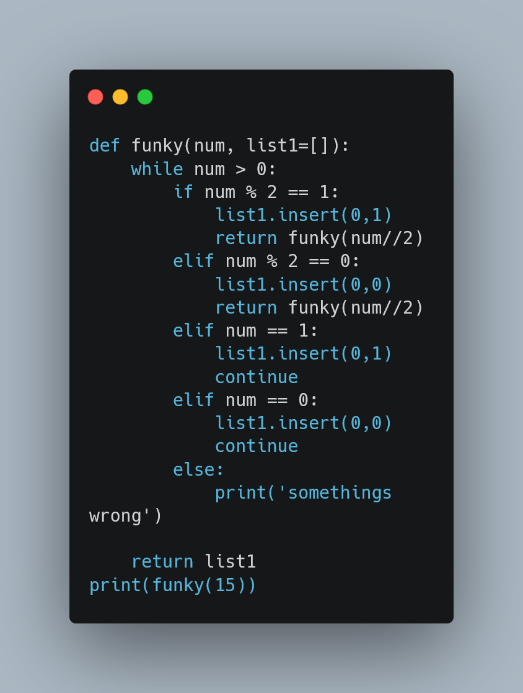

<h2>12/22/2022</h2>
Todays objectives:
<ol>
<li>Find CSS designs for: Buttons, Text, Background</li>
<li>Conditioned text format</li>
<li>Complete Base Blog Project</li>
<li>Codewars</li>
</ol>
What I learned (Web/App Development):
<p>When importing CSS from an external site, such as codepen.io, make sure
that you configure the CSS so that you can manipulate the attributes and use those attributes for designing elements that the prebuilt css code wasn't initially created for. In the Udemy Course, we see that we can manipulate a background KEYFRAMES spinify animation and adjust it so text is changed instead of background. Most of the CSS provided have additional code to display the example, so we have to get rid of those elements when we apply it.
</p>
Django Template Formatting:
There is a base.html and all other templates basically inherit specific widgets from the base. The base.html will need the starting 
``````
To link to static files in static_root folder   

For conditional template designs(if/for/.etc)
Make sure there is an end tag <(somecode)>. For more details. *endif will end if block: Nothing goes after it
https://docs.djangoproject.com/en/dev/ref/templates/language/#variables


*You can use Django with Jinja. Pip install jinja2 and change settings in Django. This link solves this problem.
https://stackoverflow.com/questions/30701631/how-to-use-jinja2-as-a-templating-engine-in-django-1-8*

<h3>Algorithms</h3>
Find domain name for URL:
using replace() method of the static beginnings of the url in the front *critical thinking question*
Recursion Algorithm:

Things to note:
<li>Putting a default list in parameters will allow you to create a list you can iterate results onto when dealing with recursion.</li>

Future Test Cases:
<li> Combining prebuilt CSS snippets </li>

<!-- ===================================================================================================== -->

<h2> 12/23/2020 </h2>
Today's Objectives:
<ol>
<li>Complete Base Blog Project</li>
<li>Data Structure and Algorithms</li>
<li>Codewars</li>
</ol>


